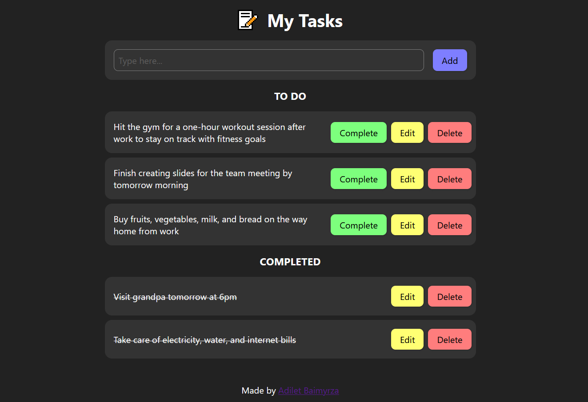

# TODO App: React + TypeScript + Vite

A simple TODO app that supports [CRUD](https://en.wikipedia.org/wiki/Create,_read,_update_and_delete) operations and utilizes LocalStorage to preserve user data. Written in TypeScript language using React framework, built with Vite and deployed to Github Pages. You can see live demo [here](https://adiletbaimyrza.github.io/react-typescript-todo-app/).



##

If you wonder how to deploy a Vite project to Github Pages, check out this [article](https://medium.com/@aishwaryaparab1/deploying-vite-deploying-vite-app-to-github-pages-166fff40ffd3).

## Run locally

```bash
git clone https://github.com/adiletbaimyrza/react-typescript-todo-app.git
cd react-typescript-todo-app
npm install
npm run dev
```

## Recommendations

1. Create a **.vscode** folder in your root directory and create **settings.json** file inside **.vscode**. Like so:

```bash
├───.vscode
|   └───settings.json
├───public
└───src
    ├───assets
    └───components
```

and paste this inside **settings.json**. This will enable you to apply formating when you save ts, tsx files in accordance with **.prettierrc** config file and **eslintrc.cjs**.

```json
{
  "editor.defaultFormatter": "esbenp.prettier-vscode",
  "eslint.probe": ["typescript", "typescriptreact", "tsx", "ts"],
  "editor.formatOnSave": true,
  "editor.codeActionsOnSave": ["source.formatDocument", "source.fixAll.eslint"]
}
```

2. Change the "homepage" key in **package.json** to your own username and repository name:

```json
"homepage": "https://{username}.github.io/{repository-name}/",
```
